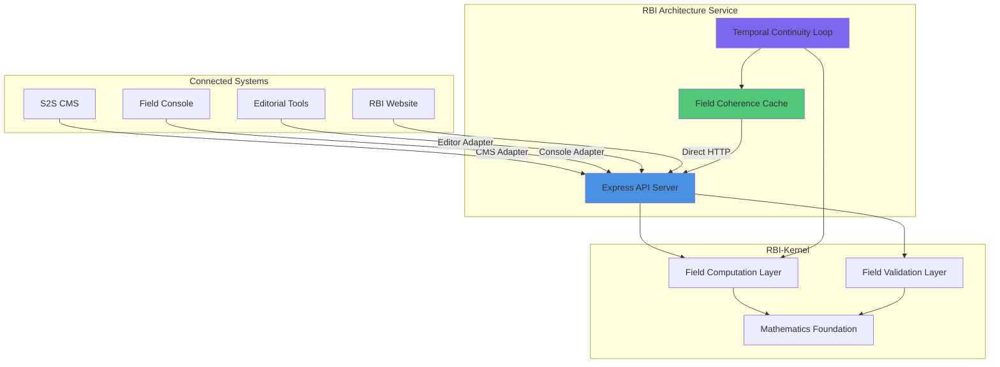

# RBI Architecture Service - Live Service Overview

**Version:** 1.1.0-service  
**Date:** 2025-11-11

---

## Overview

The RBI Architecture Service is a continuously running coherence architecture that provides field-level coherence computation accessible to all connected systems (CMS, Console, Editorial Tools, Website).

---

## Architecture Diagram



---

## Service Endpoints

### GET /health

Health check endpoint (no authentication required).

**Response:**
```json
{
  "status": "healthy",
  "service": "rbi-architecture-service",
  "version": "1.1.0-service",
  "timestamp": "2025-11-11T22:00:00.000Z"
}
```

---

### GET /metrics

Service metrics endpoint (requires authentication).

**Headers:**
```
x-api-key: your-api-key
```

**Response:**
```json
{
  "totalRequests": 1250,
  "errorCount": 5,
  "successCount": 1245,
  "errorRate": 0.4,
  "avgResponseTime": 45,
  "statusCodes": {
    "200": 1200,
    "400": 3,
    "500": 2
  },
  "timestamp": "2025-11-11T22:00:00.000Z"
}
```

---

### POST /field/score

Returns clarity, coherence, resonance, sovereignty for given input.

**Request:**
```json
{
  "content": "Text content to analyze",
  "vector": { "x": 0.8, "y": 0.9, "z": 0.85, "w": 0.8 },  // Optional
  "signature": { "clarity": 0.8, "coherence": 0.9, "resonance": 0.85, "sovereignty": 0.8 }  // Optional
}
```

**Response:**
```json
{
  "clarity": 0.8,
  "coherence": 0.9,
  "resonance": 0.85,
  "sovereignty": 0.8,
  "fieldDynamics": {
    "fieldStrength": 2.1,
    "stability": 0.9,
    "coherence": 0.85
  },
  "timestamp": "2025-11-11T22:00:00.000Z"
}
```

---

### GET /field/status

Returns service uptime and active fields.

**Response:**
```json
{
  "status": "operational",
  "service": "rbi-architecture-service",
  "version": "1.1.0-service",
  "uptime": {
    "seconds": 3600,
    "formatted": "1h 0m 0s"
  },
  "activeFields": 5,
  "cacheSize": 5,
  "timestamp": "2025-11-11T22:00:00.000Z"
}
```

---

### POST /field/validate

Runs Proof-of-Meaning verification.

**Request:**
```json
{
  "content": "Content to validate",
  "categoryAssociations": [1, 2, 3]  // Optional - domain-specific categories
}
```

**Note:** For S2S projects, `orbAssociations` is also supported for backward compatibility. For other domains, use `categoryAssociations` with your own category system.

**Response:**
```json
{
  "verified": true,
  "confidence": 0.875,
  "mathematicalProof": "proof_serialization_string",
  "resonanceVector": {
    "x": 0.8, "y": 0.9, "z": 0.85, "w": 0.8
  },
  "fieldDynamics": {
    "fieldStrength": 2.1,
    "stability": 0.9,
    "coherence": 0.85
  },
  "sovereignLogic": {
    "validity": "proven",
    "coherence": 0.85,
    "sovereignty": 0.8
  },
  "timestamp": "2025-11-11T22:00:00.000Z"
}
```

---

## Connection Guide

### S2S CMS Connection

**Location:** `S2S File Processing at Cursor/CLEANED_SYSTEM/`

**Setup:**
1. Install adapter:
   ```typescript
   import { CMSAdapter } from '../../RBI-Architecture-Service/adapters/cms-adapter.js';
   
   const adapter = new CMSAdapter({
     baseUrl: process.env.RBI_SERVICE_URL || 'http://localhost:3001'
   });
   ```

2. Use in API routes:
   ```typescript
   // In app/api/ai/process-content/route.ts
   const score = await adapter.pushData(content);
   const validation = await adapter.validateContent(content, orbAssociations);
   ```

**Environment Variable:**
```bash
RBI_SERVICE_URL=http://localhost:3001  # or production URL
```

---

### Field Console Connection

**Location:** `S2S File Processing at Cursor/CLEANED_SYSTEM/field-console/`

**Setup:**
1. Install adapter:
   ```typescript
   import { ConsoleAdapter } from '../../../../RBI-Architecture-Service/adapters/console-adapter.js';
   
   const adapter = new ConsoleAdapter({
     baseUrl: process.env.NEXT_PUBLIC_RBI_SERVICE_URL || 'http://localhost:3001'
   });
   ```

2. Use in components:
   ```typescript
   // In components or API routes
   const score = await adapter.fetchScore(inquiryText);
   ```

**Environment Variable:**
```bash
NEXT_PUBLIC_RBI_SERVICE_URL=http://localhost:3001
```

---

### Editorial Tools Connection

**Location:** `S2S_RBI_Editorial_V3/`

**Setup:**
1. Install adapter:
   ```typescript
   import { EditorAdapter } from '../RBI-Architecture-Service/adapters/editor-adapter.js';
   
   const adapter = new EditorAdapter({
     baseUrl: process.env.RBI_SERVICE_URL || 'http://localhost:3001'
   });
   ```

2. Use in tools:
   ```typescript
   const validation = await adapter.validateContent(manuscriptContent);
   ```

**Environment Variable:**
```bash
RBI_SERVICE_URL=http://localhost:3001
```

---

### RBI Website Connection

**Location:** `rbi-kernel-website/`

**Setup:**
1. Use direct HTTP calls:
   ```typescript
   const response = await fetch(`${process.env.NEXT_PUBLIC_RBI_SERVICE_URL}/field/score`, {
     method: 'POST',
     headers: { 'Content-Type': 'application/json' },
     body: JSON.stringify({ content: 'Demo content' })
   });
   const score = await response.json();
   ```

**Environment Variable:**
```bash
NEXT_PUBLIC_RBI_SERVICE_URL=http://localhost:3001
```

---

## Temporal Continuity Loop

The service runs a temporal continuity loop that:

1. **Maintains Field Coherence Cache** - Refreshes fields older than 5 minutes
2. **Monitors Resonance Drifts** - Detects and logs significant coherence changes
3. **Tracks Field Stabilization** - Calculates stability metrics

**Loop Interval:** 30 seconds (configurable via `TEMPORAL_LOOP_INTERVAL`)

**Drift Threshold:** 10% (configurable via `DRIFT_THRESHOLD`)

---

## Deployment

### Local Development

```bash
cd RBI-Architecture-Service
npm install
npm run dev
```

Service runs on `http://localhost:3001`

### Production Deployment

#### Option 1: Vercel

```bash
vercel deploy
```

#### Option 2: Docker

```bash
docker build -t rbi-architecture-service:1.1.0 .
docker run -p 3001:3001 rbi-architecture-service:1.1.0
```

#### Option 3: Docker Compose

```bash
docker-compose up -d
```

---

## Service Health

### Health Check

```bash
curl http://localhost:3001/field/status
```

**Expected Response:**
- Status: `operational`
- Uptime: `> 0 seconds`
- Active Fields: `>= 0`

---

## Monitoring

### Logs

The service logs:
- Field maintenance operations
- Resonance drift detections
- Field stabilization metrics
- Error messages

### Metrics

Available via `/field/status`:
- Service uptime
- Active field count
- Cache size
- Service version

---

## Security

### API Key Authentication

Set `RBI_API_KEY` environment variable to enable authentication. All endpoints except `/health` and `/field/status` require authentication.

**Request Headers:**
```
x-api-key: your-api-key
```
or
```
Authorization: Bearer your-api-key
```

**Error Response (401):**
```json
{
  "error": "Unauthorized",
  "message": "API key required. Provide API key in x-api-key header or Authorization header."
}
```

### Rate Limiting

- **Default:** 100 requests per minute per API key/IP address
- **Configurable:** Set `RATE_LIMIT_MAX_REQUESTS` and `RATE_LIMIT_WINDOW_MS` environment variables
- **Headers:** All responses include rate limit information:
  - `X-RateLimit-Limit`: Maximum requests per window
  - `X-RateLimit-Remaining`: Remaining requests in current window
  - `X-RateLimit-Reset`: ISO timestamp when window resets

**Error Response (429):**
```json
{
  "error": "Too Many Requests",
  "message": "Rate limit exceeded. Maximum 100 requests per 60 seconds.",
  "retryAfter": 30
}
```

### Monitoring & Logging

- Request logging with response times
- Metrics endpoint: `/metrics` (requires auth)
- Error logging with stack traces in development mode
- In-memory log storage (last 1000 requests)

### Error Handling

- Centralized error handling middleware
- Consistent error response format
- Request ID support for error tracking
- Stack traces in development mode only

---

## Version Information

- **Service Version:** 1.1.0-service
- **RBI-Kernel Version:** 1.0.0
- **Node.js:** 20.x
- **Express:** 4.18.2

---

**Document Version:** 1.1.0-service  
**Last Updated:** 2025-11-11

